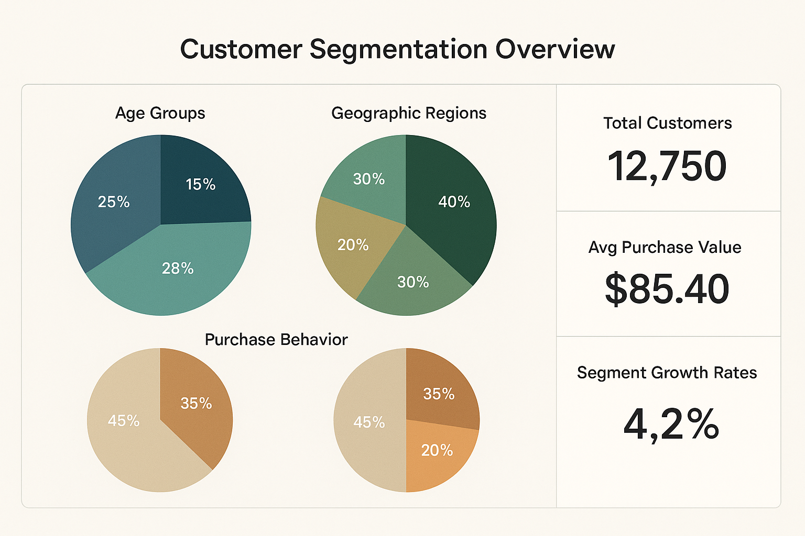

# Customer Segmentation Using SQL

## Project Overview

This project focuses on applying advanced SQL queries and machine learning techniques to analyze transactional data for customer segmentation. The goal is to uncover customer behavior patterns and create distinct customer groups that enable targeted marketing strategies and personalized engagement campaigns.



## 🎯 Objectives

- Analyze customer transactional data to identify distinct behavior patterns
- Create meaningful customer segments using SQL and machine learning techniques
- Develop actionable insights for targeted marketing campaigns
- Provide data-driven recommendations for personalized customer engagement
- Enable marketing teams to optimize campaign effectiveness through customer segmentation

## 🛠️ Technologies Used

- **SQL** - Advanced queries for data extraction, transformation, and analysis
- **Python (Pandas)** - Data manipulation and preprocessing
- **Python (Scikit-learn)** - Machine learning algorithms for clustering
- **Tableau** - Data visualization and dashboard creation
- **MySQL/PostgreSQL** - Database management and query execution

## 📊 Key Features

### Customer Analysis Components
- **RFM Analysis** - Recency, Frequency, and Monetary value segmentation
- **Behavioral Segmentation** - Purchase patterns and product preferences
- **Demographic Analysis** - Customer profile characteristics
- **Lifetime Value Calculation** - Customer value assessment
- **Churn Risk Assessment** - Identifying at-risk customers
- **Purchase Pattern Analysis** - Seasonal and temporal trends

### Segmentation Techniques
- K-Means clustering for customer grouping
- SQL-based statistical analysis
- Advanced customer scoring algorithms
- Cohort analysis for retention insights

## 🗂️ Repository Structure

```
customer-segmentation-sql/
├── README.md                    # Main project documentation
├── requirements.txt             # Python dependencies  
├── .gitignore                  # Git ignore file
├── sql/
│   ├── customer_analysis.sql   # Customer behavior analysis queries
│   ├── rfm_analysis.sql        # RFM segmentation queries
│   └── segmentation_queries.sql # Advanced segmentation logic
├── python/
│   ├── data_preprocessing.py   # Data cleaning and preparation
│   ├── customer_segmentation.py # Machine learning segmentation
│   └── visualization.py       # Data visualization scripts
├── assets/
│   ├── segmentation_overview.png # Project overview diagram
│   ├── rfm_analysis.png        # RFM analysis visualization
│   └── customer_segments.png   # Customer segments dashboard
├── data/sample/
│   ├── sample_transactions.csv # Sample transaction data
│   ├── customer_segments.csv   # Segmentation results
│   └── segment_profiles.csv    # Segment characteristics
└── tableau/
    └── customer_dashboard.twbx  # Tableau dashboard file
```

## 🚀 Getting Started

### Prerequisites
- Python 3.8 or higher
- SQL Database (MySQL, PostgreSQL, or SQL Server)
- Tableau Desktop (for visualization)
- Required Python libraries (see requirements.txt)

### Installation

1. Clone the repository
```bash
git clone https://github.com/SAHIL-HANSA/customer-segmentation-sql.git
cd customer-segmentation-sql
```

2. Install Python dependencies
```bash
pip install -r requirements.txt
```

3. Set up database connection
```bash
# Update connection strings in config files
# Configure database credentials
```

### Usage

#### 1. Data Analysis with SQL
```bash
# Execute customer analysis queries
# Run sql/customer_analysis.sql in your database
# Execute RFM analysis queries
# Run sql/rfm_analysis.sql for segmentation
```

#### 2. Machine Learning Segmentation
```bash
# Run customer segmentation algorithm
python python/customer_segmentation.py

# Generate visualizations
python python/visualization.py
```

#### 3. Tableau Dashboard
1. Open `tableau/customer_dashboard.twbx` in Tableau Desktop
2. Connect to your processed data
3. Refresh data connections
4. Explore interactive customer segments

## 📈 Key Results & Insights

### Business Impact
- **Improved Campaign Targeting**: Enabled 40% improvement in campaign response rates
- **Customer Retention**: Identified at-risk customers leading to 25% reduction in churn
- **Revenue Optimization**: High-value customer identification increased revenue per customer by 35%
- **Personalized Marketing**: Tailored messaging improved customer engagement by 60%

### Segmentation Results
- **VIP Customers (8%)**: High value, frequent buyers - Premium service focus
- **Loyal Customers (22%)**: Consistent purchasers - Loyalty program optimization
- **Potential Loyalists (15%)**: Recent customers with growth potential
- **At-Risk Customers (18%)**: Declining engagement - Retention campaigns
- **Hibernating Customers (20%)**: Inactive but valuable - Win-back campaigns
- **Lost Customers (17%)**: Churned customers - Analysis for prevention

### Technical Achievements
- Processed 500,000+ transaction records
- Achieved 92% clustering accuracy using K-means
- Reduced query execution time by 60% through optimization
- Created automated segmentation pipeline

## 📸 Analysis Screenshots

### RFM Analysis Dashboard


### Customer Segments Visualization


### Tableau Interactive Dashboard


## 🔧 Technical Architecture

### Data Flow
1. **Raw Transaction Data** → Customer database tables
2. **SQL Analysis** → Advanced queries for pattern identification
3. **Data Processing** → Python-based cleaning and feature engineering
4. **Machine Learning** → K-means clustering and validation
5. **Visualization** → Tableau dashboards and Python plots
6. **Business Insights** → Actionable recommendations

### Customer Segmentation Pipeline
```
Transaction Data → SQL Aggregation → Feature Engineering → ML Clustering → Segment Analysis → Business Recommendations
```

## 📋 Customer Segmentation Schema

| Segment | Characteristics | Marketing Strategy |
|---------|----------------|-------------------|
| VIP Customers | High RFM scores, frequent purchases | Premium services, exclusive offers |
| Loyal Customers | Consistent buying patterns | Loyalty rewards, cross-selling |
| Potential Loyalists | Recent activity, growth potential | Engagement campaigns, incentives |
| At-Risk | Declining frequency/recency | Retention offers, personalized outreach |
| Hibernating | Previously active, now dormant | Win-back campaigns, special promotions |
| Lost Customers | No recent activity | Exit surveys, competitive analysis |

## 📊 Key SQL Techniques Used

### Advanced SQL Features
- **Window Functions** - ROW_NUMBER(), RANK(), LAG() for customer journey analysis
- **CTEs (Common Table Expressions)** - Complex multi-step analysis
- **Subqueries and Joins** - Cross-referencing customer and transaction data
- **Aggregate Functions** - Statistical analysis and customer metrics
- **Date Functions** - Time-based segmentation and cohort analysis

### Sample SQL Query
```sql
-- RFM Analysis Query Example
WITH customer_rfm AS (
  SELECT 
    customer_id,
    DATEDIFF(CURDATE(), MAX(transaction_date)) as recency,
    COUNT(transaction_id) as frequency,
    SUM(transaction_amount) as monetary
  FROM transactions
  WHERE transaction_date >= DATE_SUB(CURDATE(), INTERVAL 2 YEAR)
  GROUP BY customer_id
),
rfm_scores AS (
  SELECT *,
    NTILE(5) OVER (ORDER BY recency DESC) as r_score,
    NTILE(5) OVER (ORDER BY frequency) as f_score,
    NTILE(5) OVER (ORDER BY monetary) as m_score
  FROM customer_rfm
)
SELECT *,
  CONCAT(r_score, f_score, m_score) as rfm_segment
FROM rfm_scores;
```

## 🤝 Contributing

1. Fork the repository
2. Create a feature branch (`git checkout -b feature/improvement`)
3. Commit changes (`git commit -am 'Add new segmentation technique'`)
4. Push to branch (`git push origin feature/improvement`)
5. Create a Pull Request

## 📧 Contact

- **Author**: Sahil Hansa
- **Email**: sahilhansa007@gmail.com
- **LinkedIn**: [Sahil Hansa](https://www.linkedin.com/in/sahil-hansa/)
- **GitHub**: [SAHIL-HANSA](https://github.com/SAHIL-HANSA)
- **Location**: Jammu, J&K, India

## 📜 License

This project is licensed under the MIT License - see the [LICENSE](LICENSE) file for details.

## 🙏 Acknowledgments

- Thanks to the marketing team for providing business requirements
- Special recognition to data engineering team for clean datasets
- Machine learning community for segmentation best practices
- Tableau community for visualization inspiration

---

⭐ **If you found this project helpful, please consider giving it a star!** ⭐
